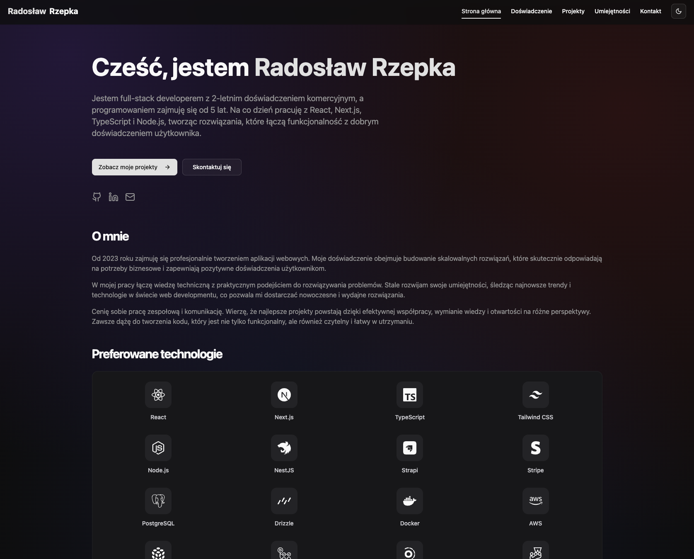
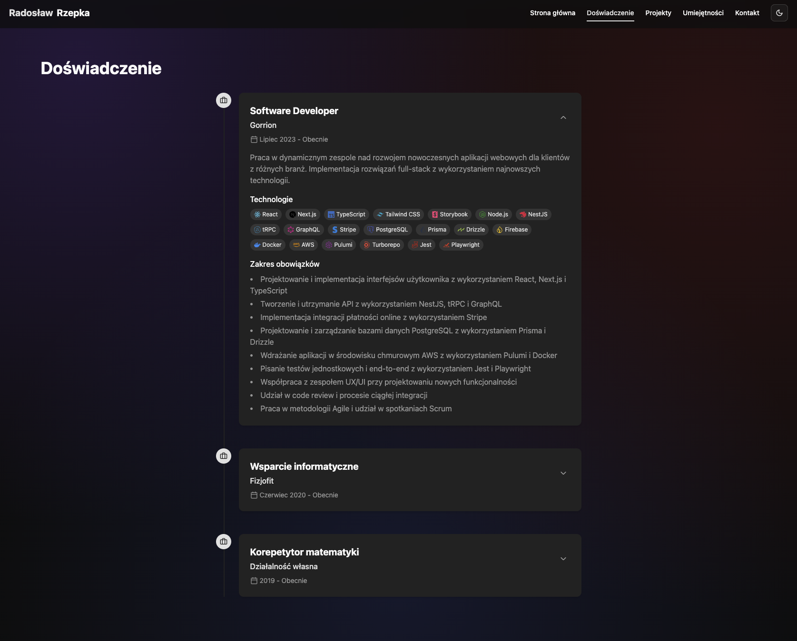
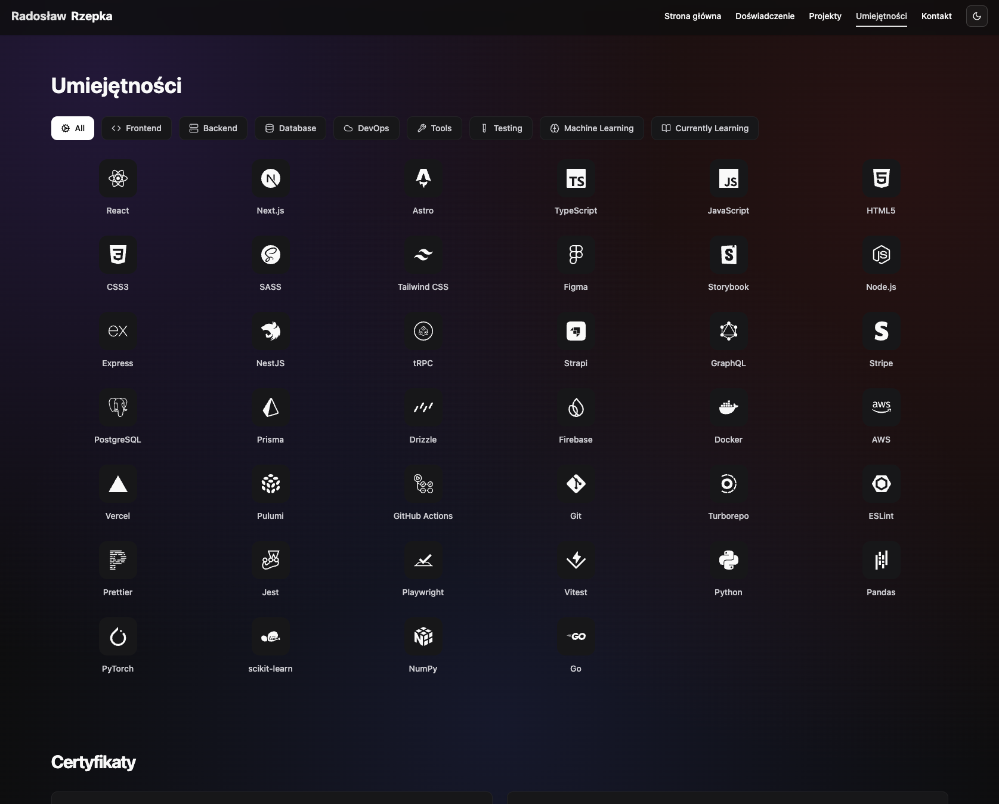

# Portfolio v2

A modern, responsive personal portfolio website built with Astro and React.

## Table of Contents

- [Portfolio v2](#portfolio-v2)
  - [Table of Contents](#table-of-contents)
  - [Overview](#overview)
  - [Key Features](#key-features)
  - [Technologies Used](#technologies-used)
    - [Frontend Technologies](#frontend-technologies)
  - [Getting Started](#getting-started)
    - [Prerequisites](#prerequisites)
    - [Installation and Setup](#installation-and-setup)

## Overview

This is a personal portfolio website showcasing my projects, skills, and professional experience. Built with Astro for optimal performance and React for interactive components, this portfolio features a clean, modern design with smooth animations and a responsive layout.

The site is designed to present my work in an elegant and user-friendly interface while maintaining excellent performance metrics.

[Live Demo](https://radoslawrzepka.me)





## Key Features

- **Modern Design**: Clean, professional interface with smooth animations and transitions
- **Dark Mode Support**: Toggle between light and dark themes for comfortable viewing
- **Responsive Layout**: Optimized for all device sizes from mobile to desktop
- **Project Showcase**: Detailed project cards with descriptions, technologies, and links
- **Skills Section**: Visual representation of technical skills organized by categories
- **Experience Timeline**: Professional experience displayed in an interactive timeline
- **Performance Optimized**: Built with Astro for excellent loading speeds and SEO

## Technologies Used

### Frontend Technologies

- **Framework**: [Astro](https://astro.build/) - Static site generator with excellent performance
- **Component Library**: [React](https://reactjs.org/) - For interactive UI components
- **Styling**:
  - [Tailwind CSS](https://tailwindcss.com/) - Utility-first CSS framework
  - [shadcn/ui](https://ui.shadcn.com/) - Re-usable UI components
- **Language**: [TypeScript](https://www.typescriptlang.org/) - For type safety and better developer experience

## Getting Started

### Prerequisites

- [Node.js](https://nodejs.org/) (v18 or higher recommended)
- [pnpm](https://pnpm.io/) - Fast, disk space efficient package manager

### Installation and Setup

1. Clone the repository:

   ```bash
   git clone https://github.com/radekrzepka/portfolio-v2.git
   ```

2. Navigate to the project directory:

   ```bash
   cd portfolio-v2
   ```

3. Install dependencies:

   ```bash
   pnpm install
   ```

4. Start the development server:

   ```bash
   pnpm dev
   ```

5. Build for production:

   ```bash
   pnpm build
   ```

6. Preview the production build:
   ```bash
   pnpm preview
   ```
